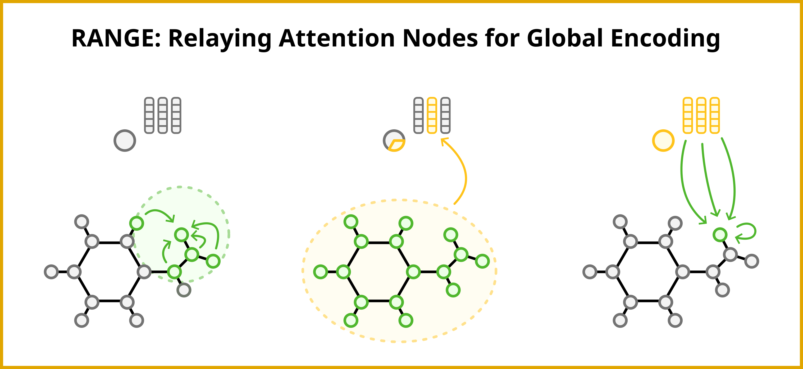

RANGE is a model-agnostic framework that employs an attention-based aggregation-broadcast mechanism to significantly reduce oversquashing effects in message-passing neural networks.

## Prerequisites
It is recommended to install the `mlcg` package (version 0.1.0) in a clean environment by following the official installation instructions available at [https://github.com/ClementiGroup/mlcg](https://github.com/ClementiGroup/mlcg).

This package provides the core infrastructure used to train and simulate all the models defined in this repository.

## Installation
Install the `rangemp` package **inside the newly created environment**:

```bash
git clone git@github.com:ClementiGroup/range.git range
cd range
pip install .
cd ..
```
